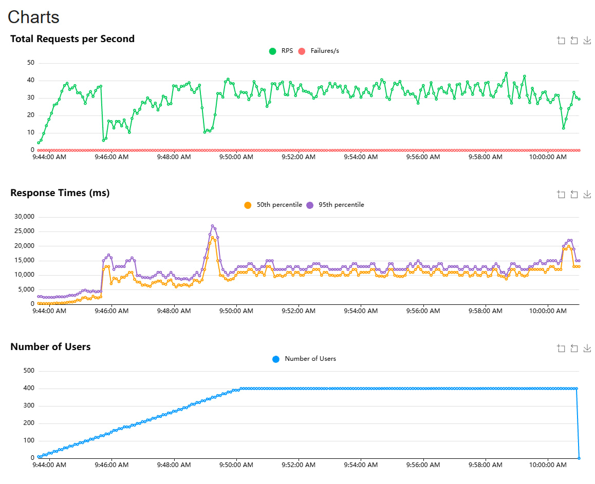
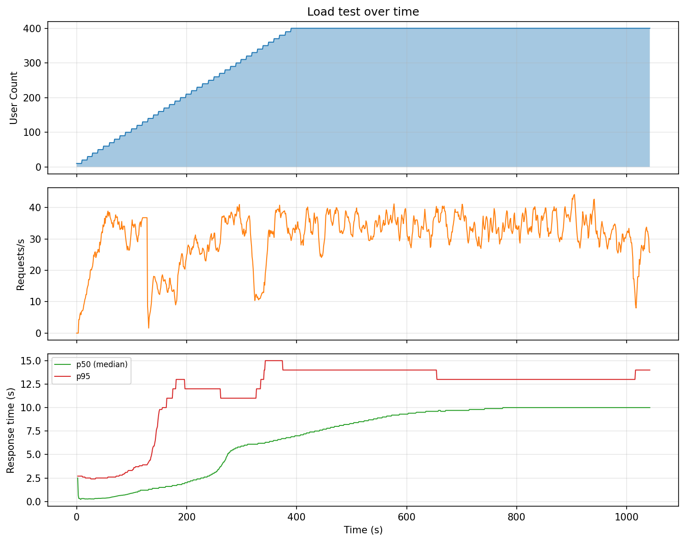

# Chat API (FastAPI + vLLM + PostgreSQL)

REST API для диалогов с языковой моделью (vLLM) с сохранением истории в PostgreSQL.



---

## Требования

- Python 3.11+
- Docker и Docker Compose (для PostgreSQL и vLLM)
- NVIDIA GPU с драйвером (для vLLM)

---

## 1. Запуск PostgreSQL и vLLM

### Вариант А: через Docker Compose (рекомендуется)

В корне проекта задайте токен Hugging Face (для загрузки модели) и запустите сервисы:

```powershell
# Токен: https://huggingface.co/settings/tokens
$env:HUGGING_FACE_HUB_TOKEN = "ваш_токен"

docker compose up -d
```

Поднимутся:
- **PostgreSQL** — порт **5433** (внутри контейнера 5432), БД `chat`, пользователь `postgres`, пароль по умолчанию `Qqwerty1!` (можно переопределить через `POSTGRES_PASSWORD` в окружении).
- **vLLM** — порт **8000**, модель `Qwen/Qwen2.5-3B-Instruct`, API-ключ `local-token`. Зависит от готовности PostgreSQL (healthcheck).

Проверка:
```powershell
docker compose ps
```
Оба контейнера должны быть в состоянии `running`. vLLM выходит на готовность через 1–3 минуты после старта.

Остановка:
```powershell
docker compose down
```

### Вариант Б: отдельные контейнеры

**PostgreSQL:**
```powershell
docker run -d --name postgres-chat `
  -e POSTGRES_DB=chat -e POSTGRES_USER=postgres -e POSTGRES_PASSWORD=Qqwerty1! `
  -p 5433:5432 -v postgres_data:/var/lib/postgresql/data `
  postgres:15
```

**vLLM** (нужен `$env:HUGGING_FACE_HUB_TOKEN`):
```powershell
docker run -d --gpus all --name vllm-qwen `
  -p 8000:8000 `
  -v ${env:USERPROFILE}\.cache\huggingface:/root/.cache\huggingface `
  -e HUGGING_FACE_HUB_TOKEN=$env:HUGGING_FACE_HUB_TOKEN `
  vllm/vllm-openai:latest `
  --model Qwen/Qwen2.5-3B-Instruct --dtype float16 --max-model-len 4096 `
  --gpu-memory-utilization 0.88 --api-key local-token
```

Дальше: `docker start postgres-chat`, `docker start vllm-qwen` (или `docker stop ...`).

---

## 2. Запуск API

Убедитесь, что PostgreSQL и vLLM уже запущены (п. 1).

```powershell
# В корне проекта
pip install -r requirements.txt
uvicorn main:app --reload --port 8080
```

API будет доступен по адресу: **http://localhost:8080**

Эндпоинты:
- **GET /health** — проверка работы сервиса
- **POST /chat** — отправить сообщение: `{"content": "текст", "session_id": "опционально"}`
- **GET /chat/{session_id}** — история диалога по сессии

Настройки задаются в `.env` (см. `.env.example`) или в `config.py`:
- `database_url` — подключение к PostgreSQL (по умолчанию `localhost:5433`, БД `chat`)
- `api_base_url` — URL API для тестов (по умолчанию `http://localhost:8080`)
- `vllm_base_url` — URL vLLM (по умолчанию `http://localhost:8000`), `vllm_api_key` — `local-token`

Таблицы в БД создаются при старте API (SQLAlchemy). Ручное создание: `psql -U postgres -h localhost -p 5433 -d chat -f sql/init.sql`.

---

## 3. Запуск тестов (pytest)

Перед тестами должен быть запущен API (п. 2) в отдельном терминале.

```powershell
# В корне проекта
pip install -r requirements.txt
pytest tests/test_scenarios.py -v
```

С выводом `session_id` и ссылок на историю:
```powershell
pytest tests/test_scenarios.py -v -s
```

Порт API по умолчанию — 8080. Другой порт:  
`$env:api_base_url="http://localhost:9000"; pytest tests/test_scenarios.py -v`  
(или задать `api_base_url` в `.env`).

---

## 4. Нагрузочное тестирование (Locust)

Перед запуском Locust должны быть запущены API, PostgreSQL и vLLM (п. 1 и 2).



Тест по умолчанию **пошагово увеличивает нагрузку** и может останавливаться при достижении порогов (число ошибок или задержка p95). Цель — найти точку поломки (bottleneck).

### Режим «поиск точки поломки» (рекомендуется)

Останов при первой ошибке или при p95 > 5 с. Ограничение по времени — например 10 мин:

```powershell
$env:FIND_BREAKING_POINT="1"; locust -f locustfile.py --host=http://localhost:8080 --headless -t 10m --html=report.html --csv=report
```

В консоли и в файле `report_bottleneck.html` появится итог: найдена ли точка поломки и при каких правилах. В отчётах смотрите число пользователей и RPS в момент остановки.

### С веб-интерфейсом

```powershell
locust -f locustfile.py --host=http://localhost:8080
```

Откройте **http://localhost:8089**. Нагрузка задаётся формой step load; тест может остановиться при срабатывании порогов. Графики RPS, Latency, Failures во вкладках.

### Headless без ограничения по времени

Тест завершится при достижении порогов (ошибки или задержка):

```powershell
locust -f locustfile.py --host=http://localhost:8080 --headless --html=report.html --csv=report
```

Для поиска точки поломки лучше включить `FIND_BREAKING_POINT=1` и задать `-t 10m` (или больше), чтобы при стабильной системе тест не шёл бесконечно.

### Пороги и параметры нагрузки (переменные окружения)

| Переменная | По умолчанию | С `FIND_BREAKING_POINT=1` | Описание |
|------------|--------------|---------------------------|----------|
| `FIND_BREAKING_POINT` | 0 | — | Режим «найти точку поломки» |
| `FAILURE_THRESHOLD` | 20 | 1 | Останов при числе ошибок ≥ |
| `RESPONSE_TIME_THRESHOLD_SEC` | 20 | 5 | Останов при задержке (сек) > |
| `RESPONSE_TIME_USE_P95` | 0 | 1 | Использовать p95 вместо медианы |
| `STEP_DURATION` | 10 | 10 | Добавлять пользователей каждые N секунд |
| `USERS_PER_STEP` | 2 | 10 | Пользователей за шаг |
| `MAX_USERS` | 50 | 400 | Максимум виртуальных пользователей |

После прогона: `report.html`, `report_bottleneck.html`, `report_stats.csv`, `report_failures.csv` и др. Итоговое сообщение о bottleneck выводится в консоль и в `report_bottleneck.html`.
